# ML System Design Doc - [RU]
## Дизайн ML системы - Сервис для распределения заявок в поддержку БИА 👨‍💻 - MVP🚀

### 1. Цели и предпосылки 

#### 1.1. Зачем идем в разработку продукта?

**Бизнес-цель `Product Owner`:**

-   Автоматизация процесса классификации заявок в поддержку компании "BIA Technologies" с целью повышения эффективности работы отдела поддержки и улучшения скорости, качества обслуживания клиентов.

**Почему станет лучше, чем сейчас, от использования ML `Product Owner` & `Data Scientist`:**

-   **Сокращение времени обработки заявок:** Уменьшение времени, затрачиваемого сотрудниками на ручную классификацию заявок, позволит быстрее реагировать на запросы клиентов.
-   **Улучшение точности классификации:** Машинное обучение снизит количество ошибок при определении категории заявки, что сократит время на перенаправление между отделами и ускорит решение проблем.
-   **Снижение затрат на обучение новых сотрудников:** Автоматизация рутинных задач уменьшит необходимость в длительной адаптации новых сотрудников, позволяя им быстрее приступить к эффективной работе.

**Что будем считать успехом итерации с точки зрения бизнеса `Product Owner`:**

-   Достижение точности классификации не менее 80% за период опытно-промышленной эксплуатации (тестовый период).
-   Сокращение среднего (медианного) времени классификации заявки от 50%.
-   Положительная обратная связь от сотрудников поддержки о удобстве и эффективности нового инструмента.

#### 1.2. Бизнес-требования и ограничения

**Краткое описание БТ и ссылки на детальные документы с бизнес-требованиями `Product Owner`:**
   
   -   **Бизнес-требования:**
       -   Разработка ML-модели для автоматической классификации заявок по параметрам "Услуга БИА" и "Вид заявки БИА" на основе текстовых данных.
       -   Интеграция модели с существующей системой Jira.
       -   Обеспечение обновляемости модели с использованием новых поступающих данных.
   -   **Ссылки на детальные документы:**
       -   *К сожалению, документы компании "BIA Technologies" находятся под NDA, я не могу включить их в данный документ* 🥲
    
**Бизнес-ограничения `Product Owner`:**
    
   -   **Соблюдение конфиденциальности:** Данные заявок содержат конфиденциальную информацию и должны обрабатываться в соответствии с политиками безопасности компании.
   -   **Ограничения по ресурсам:** Ограниченные вычислительные ресурсы для обучения и развёртывания модели: отсутствуют машины с графическими ускорителями.
   -   **Требования к интеграции:** Необходимо обеспечить бесшовную интеграцию с существующей инфраструктурой без значительных изменений в текущих процессах.
   
 **Что мы ожидаем от конкретной итерации `Product Owner`:**
    
  -   Создание MVP решения с базовой моделью классификации (определение только поля "Услуга БИА")
  -   Интеграция MVP с системой Jira для реального тестирования.
  -   Сбор метрик и обратной связи для оценки эффективности решения.

 **Описание бизнес-процесса пилота `Product Owner`:**
    
   -   При поступлении новой заявки в Jira, система автоматически передаёт текстовые поля заявки в ML-сервис в формате json через REST API в теле запроса.
   -   ML-сервис возвращает предсказанные значения для полей "Услуга БИА" в теле ответа.
   - Значения, предсказанные сервисом, публикуются в поля в UI Jira, визуально доступных клиентам и агентам поддержки.
   - Средствами Jira заявка направляется к сотруднику / команде, отвественным за установленную "Услуга БИА".
   -   Сотрудник поддержки проверяет и при необходимости корректирует предложенные системой значения.
   -   Данные о корректировках собираются для последующего обучения и улучшения модели.
 
**Что считаем успешным пилотом? Критерии успеха и возможные пути развития проекта `Product Owner`:**
    
   -   **Критерии успеха:**
       -   Точность модели соответствует или превышает установленный порог (80% доля верной классификации).
       -   Сотрудники поддержки отмечают сокращение времени на обработку заявок.
       -   Система работает стабильно без сбоев и задержек.
   -   **Пути развития:**
       -   Расширение функциональности на другие очереди и отделы.
       -   Повышение качества классификации путём улучшения моделей.
       -   Внедрение дополнительной автоматизации, например, автоматическое назначение ответственного или решение простых инцидентов.

#### 1.3. Что входит в скоуп проекта/итерации, что не входит

**На закрытие каких БТ подписываемся в данной итерации `Data Scientist`:**
    
   -   Разработка и обучение модели машинного обучения для классификации заявок.
   -   Предобработка и анализ данных (EDA) для подготовки данных к моделированию.
   -   Интеграция модели с системой Jira через REST API.
   -   Создание MLOps пайплайна для автоматизированного обучения и обновления модели.

**Что не будет закрыто `Data Scientist`:**
    
   -   Поддержка мало представленных классов (классы с очень малым количеством примеров).
   -   Обработка вложений и дополнительных файлов в заявках.
   -   Реализация интерфейса для настройки и управления моделью со стороны сотрудников / руководителей отдела поддержки.
   -   Реализация функций объяснимости модели (Explainable AI).

**Описание результата с точки зрения качества кода и воспроизводимости решения `Data Scientist`:**
    
   -   Код сервиса и исследования будет структурированным, написанным в чистом codestyle, согласно pep8 и статическим проверкам.
   - Код сервиса будет написан в ООП парадигме с использованием паттернов проектирования, покрыт модульными тестами не менее чем на 90%.
   -   Использование систем контроля версий (Git) и управления пакетами (poetry).
   -   Окружение для запуска сервиса будет воспроизводимым благодаря использованию контейнеризации (Docker).
   -   Версионирование данных и моделей с использованием MLOps инструментов (например, ClearML).

**Описание планируемого технического долга (что оставляем для дальнейшей продуктивизации) `Data Scientist`:**
    
   -   **Масштабируемость:** Сервис не оптимизирован для высокой нагрузки и требует доработки для обработки большего количества запросов.
   -   **Обработка новых типов данных:** В будущем потребуется добавить обработку вложений и изображений в заявках.
   -   **Мониторинг и алерты:** Не реализован полный мониторинг производительности модели и системы в целом.

#### 1.4. Предпосылки решения

-   **Описание всех общих предпосылок решения, используемых в системе `Data Scientist`:**
    -   **Данные:**
        -   Используются исторические данные из Jira за период с 01.04.2022 по 18.05.2024.
        -   Общее количество заявок: 23,906.
        -   После обработки и фильтрации доступно 12,754 образца для обучения.
    -   **Классы:**
        -   Предполагается работать с классами "Услуга БИА".
        -   В выборке присутствуют 105 видов заявок из 116 существующих "Услуга БИА", .
        -   Будут использоваться только классы с количеством примеров более 20 (это составляет 97.7% данных).
    -   **Технические предпосылки:**
        -   Модель должна обрабатывать русскоязычные тексты.
        -   Предполагается, что тексты заявок достаточно информативны для точной классификации.
        -   Ограничения на вычислительные ресурсы требуют эффективных решений (например, использование облегчённых моделей).

### 2. Методология `Data Scientist`

#### 2.1. Постановка задачи

 **Техническая задача:**
   -   **Задача ML&DS**: Разработка системы автоматической многоклассовой классификации текстовых заявок (многоклассовой иерархической классификации на этапе Release).
  - **Задача Backend**: Разработка сервиса с REST API для организации доступа к модели.
  - **Задача MLOps**: Разработка pipeline для автоматического сбора данных и обучения модели. 
 
 **Подходы к решению:**
   -   Использование методов обучения с учителем для текстовой классификации.
   -   Исследование различных моделей: от классических алгоритмов до DL моделей, AutoML фреймворков.
   -   Применение техник обработки естественного языка (NLP) для предобработки и векторизации текстов.
   -   Создание пайплайна MLOps для автоматизации обучения и развёртывания модели.

#### 2.2. Блок-схема решения

**Блок-схема для бейзлайна (исследовательская часть):**

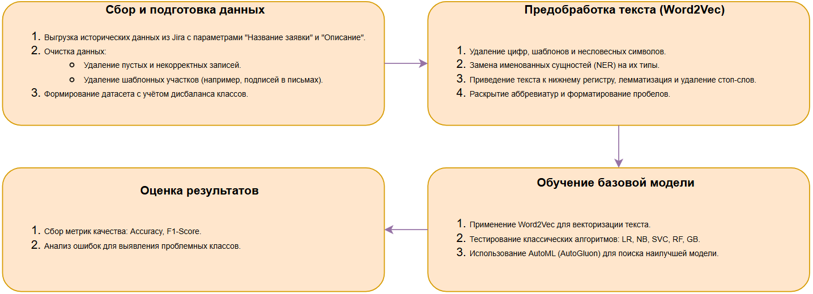

**Блок-схема для MVP (разработка минимального рабочего решения):**

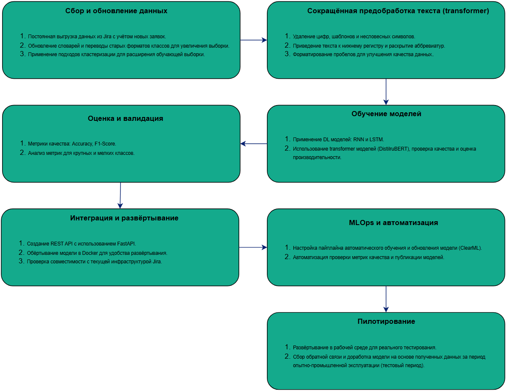

#### 2.3. Этапы решения задачи `Data Scientist` 

Общий подход к решению задачи предполагает прохождение нескольких этапов. В качестве логических шагов выделим:

> - Этап 1 - Подготовка данных
> - Этап 2 - Разработка и оценка базовых моделей (Baseline)
> - Этап 3 - Интерпретация результатов и согласование с заказчиком (Baseline итоги)
> - Этап 4 - Разработка и оценка MVP модели
> - Этап 5 - Интеграция бизнес-правил, подготовка бизнес-метрик
> - Этап 6 - Подготовка инференса модели, интеграция с сервисом и MLOps
> - Этап 7 - Подготовка итогового отчёта и принятие решения о полноценном внедрении

Ниже описаны подробности по каждому этапу, с указанием входных данных, техники решения, промежуточных результатов и критериев перехода к следующему этапу. Также будут отражены риски и способы их минимизации.

**Этап 1 – Подготовка данных** 📊

Цель: Сформировать качественную витрину данных для обучения и тестирования моделей, обеспечить воспроизводимость и документирование подготовительного пайплайна.

Исходные данные: 
- Исторические заявки из Jira, выгруженные через HTML-парсинг. 
- Период сбора данных 01.04.2023 - сейчас (обосновано ЗС как релевантный период анализа)
- Заявки непрерывно создаются пользователями, далее будут описаны подходы решения.

Для каждой заявки есть следующие поля:

- Название заявки (title) - полезный признак, несущий важную информацию о классе.
- Тип заявки (issue_type) - устанавливается Jira автоматически, если пользователь не выбрал значение (зачастую), бесполезный признак.
- Приоритет (priority) - устанавливается Jira автоматически, если пользователь не выбрал значение (зачастую), бесполезный признак. 
- Текстовое описание (description) - наиболее полезный признак, ключевая информация о классе.
- Автор (author) - вредный признак, т.к. корреляции замечено не было, присутствует крайне ограниченное количество образцов для большинства пользователей.
- Услуга (new_service), Услуга (old_service) - целевая переменная в актуальном и устаревшем форматах.
- Вид заявки (new_type), Вид заявки (old_type) - целевая переменная, в актуальном и устаревшем форматах (предсказываем только на этапе пилота).

Пример заявки:

Визуализация EDA:

**Распределение классов** `Услуга БИА`

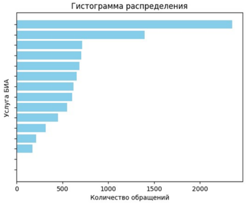

**Распределение классов** `Вид обращения БИА`

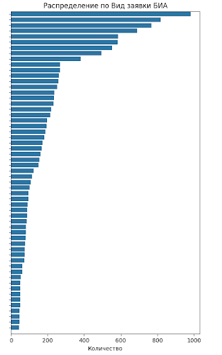

**Распределение `Услуга БИА` в данных до перевода данных**

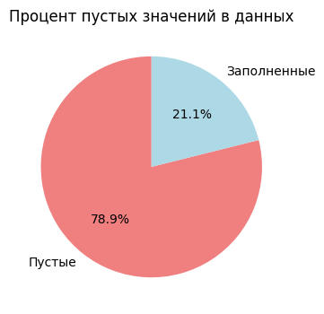

**Распределение `Услуга БИА` в данных после перевода данных**

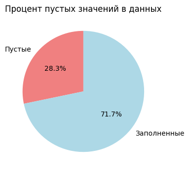

**Boxplot количества слов в тексте до IQR**

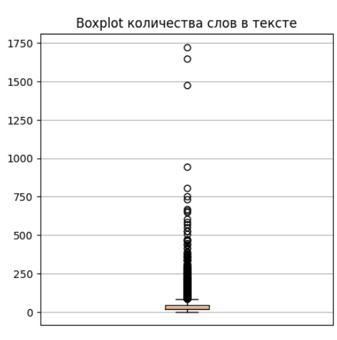

**Boxplot количества слов в тексте после IQR**

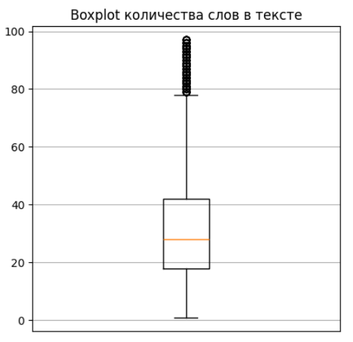

**Распределение длины текстов**

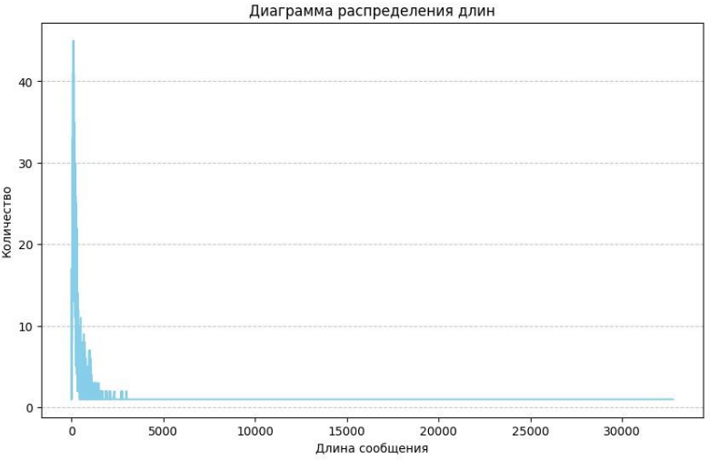

**Распределение количества слов текстов**

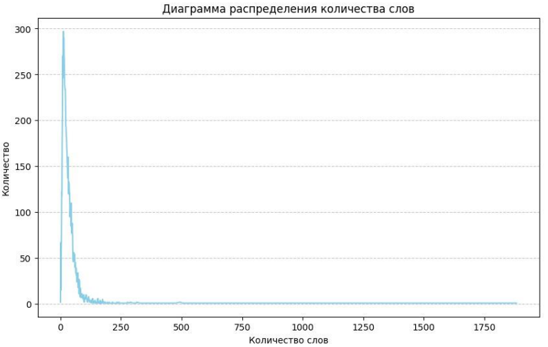

**Стратегия кластеризации**

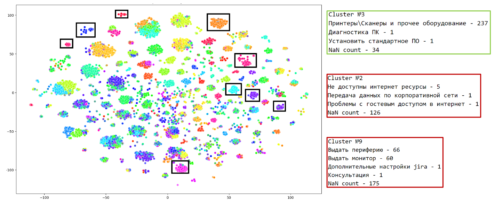

После EDA были выявлены особенности:

1) Доступно всего ~23,000 заявок.
2) Примерно 5,000 заявок имеют новый формат классов (new_service, new_type).
3) После маппинга устаревших классов по документации поддержки: +8,000 заявок переведено в новый формат.
4) После кластеризации и переоценки классов: +4,000 примеров для целевых классов.
5) Итого получено ~17,000 пригодных к использованию образцов.
6) Имеется 2 фактически пустых класса (1 и 2 заявки соответственно), работаем с остальными 12
7) Из набора были удалены записи с пустым текстом, аномалии (IQR), выполнена очистка от шаблонных подписей.

Таблица источников данных:

| Название данных                         | Источник               | Ресурс для получения                | Проверено ли качество данных        |
|-----------------------------------------|------------------------|-------------------------------------|-------------------------------------|
| Заявки Jira (HTML)                      | Jira Queue IMJSD       | DS/DE (доступ к Jira + скрипт)      | Да, подтверждено ЗС                 |
| Таблица перевода классов                | От ЗС (Excel)          | DS/PM (договорённости с заказчиком) | Да, подверждено ЗС                  |
| Доп. справочные данные (иерархия услуг) | Документация поддержки | DS/PM                               | Да, проверка полноты и актуальности |
| Список актуальных классов               | От ЗС (Excel)          | DS/PM                               | Да, подтверждено ЗС                 |

Не используем feature-engineering вследствие отсутствия доступных feature (используем только название + текст заявки).

На выходе этапа:

- Витрина данных в формате CSV/Parquet с полями: full_text, new_service, new_type, готовая к векторизации.
- Две версии наборов:
    - Для бейзлайна (Baseline): Фокус на определение "Услуга" с урезанным набором данных (примерно 10-12k образцов) без усложнённой предобработки.
    - Для MVP: Аналогичный фокус, более полный набор (~17k образцов), с применением кластеризации и расширенных техник предобработки.

Риски:

1) Недостаточно данных для некоторых классов -> Используем порог min_samples=20, классы с меньшим числом примеров исключаем.
2) Некорректный маппинг устаревших классов -> Перекрёстная проверка с документацией. Если класс нельзя однозначно привести – исключаем или оставляем как неопределённый (NaN).

Критерий перехода к следующему этапу:

1) Имеется очищенный набор данных.
2) Понятна структура итоговых данных (X - full_text, Y - new_service/new_type).
3) Принято решение о начале моделирования (Baseline).

**Этап 2 – Разработка и оценка базовых моделей (Baseline)** 🤖

Цель: Проверить принципиальную решаемость задачи предсказания "Услуги" как первой целевой переменной, получить первичные метрики качества.

Подходы:

| Алгоритмы и модели                                        | Разделение данных    | Метрики            | Пороговые значения                 |
|-----------------------------------------------------------|----------------------|--------------------|------------------------------------|
| Применить классические ML-алгоритмы (LR, NB, SVC, RF, GB) | 80/20                | Accuracy, F1-Score | ЗС ожидает ~0.75 по обеим метрикам |
| AutoML фреймворк (AutoGluon)                              | Задаётся фреймворком | Accuracy, F1-Score | ЗС ожидает ~0.75 по обеим метрикам |

Технические детали:

- Выбраны наиболее удобная и интерпретируемая ЗС метрика - Accuracy и универсальная F1-Score для DS. 
- Выборка разделена в стандартной пропорции для ML, установлен флаг stratify по пропорциям классов.
- AutoGluon использует cross-validation для стабилизации результата, выбора действительно лучшего стекинга.
- Векторизация: Word2Vec (предобученные эмбеддинги отсутствуют, обучаем на корпусе заявок).
- Выбор лучшего решения по F1-score на валидации.

Ожидаемый результат:

- Получить понимание, что задача решаема на уровне, желаемом ЗС (возможно, не получим целевое качество сразу, но сформируем гипотезы для улучшения).
- Выделить лучшую базовую модель (наиболее вероятно, стекинг от AutoGluon).

Риски:

1) Недостаточно высокие метрики -> возможно потребуется расширить данные или улучшить предобработку.
2) Слишком долгое инференс-время стекинга -> на данном этапе это не критично, но зафиксируем для MVP.

Критерий перехода к следующему этапу (Этап 3):

1) Показаны метрики на уровне не ниже порога, установленного для подтверждения интереса заказчика.
2) Подготовлена презентация результатов и шагов по улучшению.

**Этап 3 – Интерпретация результатов и согласование с заказчиком (Baseline итоги)** 🔍

Цель: Представить результаты baseline экспериментов бизнесу, согласовать дальнейшие шаги.

Подход:

- Показать метрики Accuracy, F1-Score, confusion matrix.
- Демонстрация примеров классификации: правильно классифицированные заявки, ошибки модели.
- Обсудить проблемы: например, время инференса, классы с низкой поддержкой.

Ожидаемый результат:

- Заказчик убеждается, что сервис имеет потенциал.
- Дается зелёный свет на следующий шаг – разработку MVP, где будет повышено качество и удовлетворены НФТ.
- Возможно, заказчик предложит новые данные или уточнит бизнес-правила.

Критерий перехода к следующему этапу (Этап 4):

1) Получено согласование трудозатрат на доработку модели и сервиса до уровня MVP.
2) Получены критерии MVP сервиса: например, увеличенная точность (целевой порог F1 ⩾ 0.8) и/или снижении времени отклика.

Этап 4 – Разработка и оценка MVP модели 🦾🤖

Цель: Создать прототип модели с улучшенным качеством и производительностью, удовлетворяющую обновлённым НФТ.

Подходы:

| Алгоритмы и модели    | Разделение данных | Метрики            | Пороговые значения                |
|-----------------------|-------------------|--------------------|-----------------------------------|
| DL модели (RNN, LSTM) | 80/5/15           | Accuracy, F1-Score | ЗС ожидает ~0.8 по обеим метрикам |
| DistilRuBERT          | 80/5/15           | Accuracy, F1-Score | ЗС ожидает ~0.8 по обеим метрикам |

Технические детали:
- Данные: ~17k образцов после расширения.
- Выборка разделена в стандартной пропорции для ML, установлен флаг stratify по пропорциям классов.
- Техника предобработки: для Transformer меньше агрессивных шагов (оставляем стоп-слова, не лемматизируем), но по-прежнему удаляем шаблонные подписи, лишние цифры.
- Использование Transformer-модели (DistilRuBERT или аналог) для векторизации текста.

Риски:

- Возможные проблемы с обновлением модели на реальных данных (постоянно создаются новые) -> решаем через MLOps пайлпайн переобучения (период определим с ЗС на этапе перехода к пилоту).

Критерий перехода к следующему этапу (Этап 5):

- Достигнуты целевые метрики, удовлетворяющие бизнес-требованиям и НФТ.

**Этап 5 – Интеграция бизнес-правил, подготовка бизнес-метрик** 📈

Цель: Подготовить модель к эксплуатации с учётом специфических бизнес-правил и метрик.

Подход:

- Встроить бизнес-правила (например, корректировки при крайних случаях, стандартные ответы для редких классов).
- Рассчитать бизнесовые метрики: снижение медианного времени классификации.

Ожидаемый результат:

1) Отдельный скрипт или модуль для Jira, формирующий бизнес-метрики.
2) Валидация бизнесом, что предоставленные результаты интерпретируемы и полезны.

Критерий перехода к следующему этапу (Этап 6):

1) Согласовано с бизнесом, что модель выдаёт результаты, понятные и полезные для процесса поддержки.

**Этап 6 – Подготовка инференса модели, интеграция в полнофункциональный сервис с MLOps и БД** 🌎

Цель: Обеспечить полноценную интеграцию модели в сервис с REST API, а также реализовать MLOps пайплайн для автоматического переобучения.

Подход:

- Разработка сервиса на FastAPI с эндпоинтами.

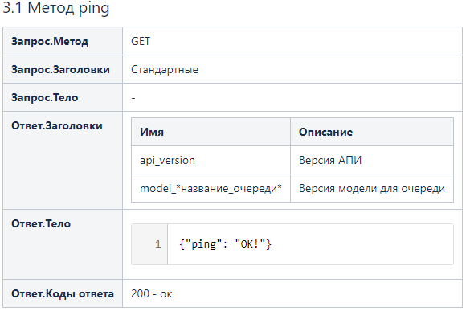

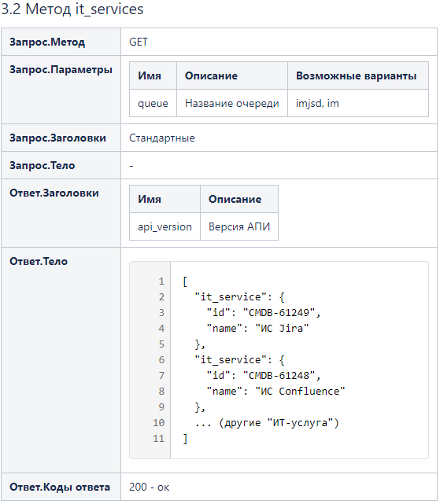

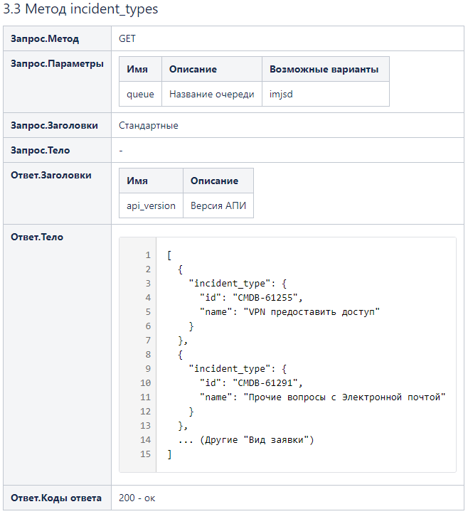

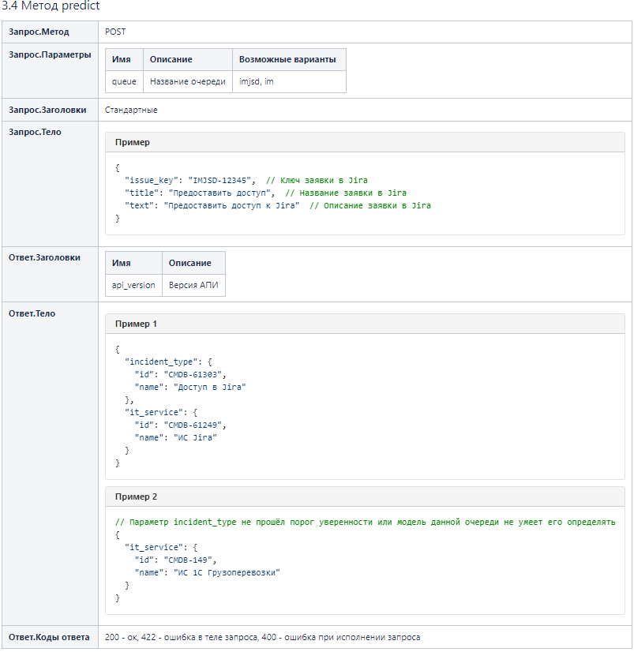

- Интеграция с ClearML как с холодным хранилищем моделей и данных (автоматизацию реализуем на этапе пилота).
- Тестирование нагрузки (Locust), модульные тесты (pytest), покрытие >90%.
- Интеграция с БД ClickHouse для сбора данных от пользователей (тексты заявок, предсказанные классы).

Ожидаемый результат:

1) Запущенный в тестовом контуре сервис, доступный по API.
2) Настроенный CI/CD, интеграции с ClearML, ClickHouse.
3) Подтверждено, что сервис обрабатывает нужный RPS, удовлетворяет SLA.
4) Сервис интегрирован в продуктовую версию Jira.

Критерий перехода к следующему этапу (Этап 7):

1) Успешное прохождение периода ОПЭ (Опытно-промышленной эксплуатации).

**Этап 7 – Подготовка итогового отчёта и принятие решения о полноценном внедрении** 🚀

Цель: Сформировать финальный отчёт и презентацию для ЗС, обосновать целесообразность постоянного использования решения.

Подход:

- Подготовка презентации с итоговыми метриками до/после внедрения.
- Отражение достигнутых улучшений: снижение медианного времени классификации, рост точности.
- Согласование с ЗС дальнейшего развития (поддержка, модернизация, масштабирование).

Ожидаемый результат:

1) Итоговый отчёт, подтверждающий достижение бизнес-целей.
2) Документированная стратегия на дальнейшее использование, расширение функционала.

Критерий завершения MVP-стадии проекта (переход к фазе пилота):

1) Принято решение о полноценном внедрении в промышленный контур.